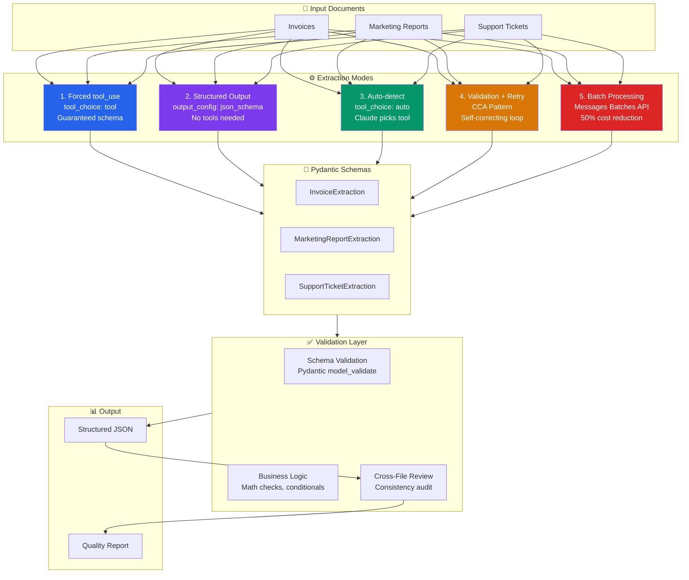

# Structured Extraction Pipeline with Claude Code Configuration

A production-ready structured data extraction system built on the Anthropic Claude API, demonstrating five extraction strategies — forced tool_use, output_config JSON schema, auto-detect multi-tool, validation-retry loops (CCA pattern), and batch processing — across invoices, marketing reports, and support tickets. The project includes a complete Claude Code configuration layer (CLAUDE.md, context-aware rules, slash commands, skills, MCP servers, and CI/CD scripts) showcasing how to build, validate, and operationalize LLM-powered extraction pipelines.

## Architecture



## Project Structure

```
structured-extraction-claude-config/
├── CLAUDE.md                          # Project guide for Claude Code
├── .claude/
│   ├── settings.json                  # Permissions, hooks, deny rules
│   ├── rules/
│   │   ├── python-tests.md            # Test conventions (paths: tests/**)
│   │   ├── extraction-schemas.md      # Schema rules (paths: schemas.py)
│   │   └── api-calls.md              # API patterns (paths: extractor, validator, batch)
│   ├── commands/
│   │   ├── extract.md                 # /extract <file> — run extraction
│   │   ├── add-schema.md             # /add-schema <type> — scaffold new schema
│   │   └── review-extraction.md      # /review-extraction — quality report
│   └── skills/
│       └── schema-designer.md         # Schema design from example documents
├── .mcp.json                          # MCP servers (filesystem, github)
├── extraction/
│   ├── schemas.py                     # Pydantic v2 models + get_tool_definition()
│   ├── extractor.py                   # 3 extraction strategies
│   ├── validator.py                   # Validation + CCA retry loop
│   ├── batch_processor.py            # Message Batches API
│   └── multi_pass.py                 # Cross-document consistency review
├── sample_data/
│   ├── invoices/invoice_001.txt       # Indonesian vendor → US client invoice
│   ├── marketing_reports/q1_2026_report.txt  # Q1 multi-channel performance
│   └── support_tickets/ticket_001.txt # Urgent dashboard outage ticket
├── tests/
│   └── test_extraction.py            # 19 unit tests (no API calls)
├── ci/
│   ├── extract_and_validate.sh       # Single-doc CI extraction
│   └── batch_extract.sh             # Directory batch CI extraction
├── main.py                           # Demo runner (4 modes)
└── requirements.txt
```

## Setup

### Prerequisites

- Python 3.11+
- An [Anthropic API key](https://console.anthropic.com/)
- [Claude Code CLI](https://docs.anthropic.com/en/docs/claude-code) (for slash commands and CI scripts)

### Installation

```bash
# Clone the repository
git clone https://github.com/mufibra23/structured-extraction-claude-config.git
cd structured-extraction-claude-config

# Create and activate virtual environment
python -m venv venv
# Windows
venv\Scripts\activate
# macOS/Linux
source venv/bin/activate

# Install dependencies
pip install -r requirements.txt

# Configure API key
echo "ANTHROPIC_API_KEY=sk-ant-your-key-here" > .env
```

### Verify Installation

```bash
# Run tests (no API key needed)
python -m pytest tests/ -v

# Run all demos (requires API key)
python main.py
```

## Usage

### Demo 1: Forced tool_use (Invoice Extraction)

Forces Claude to call exactly one tool, guaranteeing structured output.

```python
from extraction.extractor import extract_invoice

with open("sample_data/invoices/invoice_001.txt") as f:
    text = f.read()

result = extract_invoice(text)
# tool_choice={"type": "tool", "name": "extract_invoice"}
# Returns: {"invoice_number": "INV-2026-0342", "vendor_name": "PT. Digital Nusantara Solutions", ...}
```

### Demo 2: Structured Output (Marketing Report)

Constrains Claude's entire response to match a JSON schema — no tools involved.

```python
from extraction.extractor import extract_with_structured_output

with open("sample_data/marketing_reports/q1_2026_report.txt") as f:
    text = f.read()

result = extract_with_structured_output(text, "marketing_report")
# output_config={"format": {"type": "json_schema", "schema": schema}}
# Returns: {"report_period": "Q1 2026", "total_spend": 45200.0, "channels": [...], ...}
```

### Demo 3: Auto-detect Multi-tool (Support Ticket)

All three tools provided — Claude decides which document type it's looking at.

```python
from extraction.extractor import extract_auto_detect

with open("sample_data/support_tickets/ticket_001.txt") as f:
    text = f.read()

result = extract_auto_detect(text)
# tool_choice={"type": "auto"}
# Returns: {"tool_used": "extract_support_ticket", "data": {...}, "reasoning": "..."}
```

### Demo 4: Validation + Retry Loop (CCA Pattern)

Extract, validate, feed errors back as `tool_result` with `is_error=True`, Claude self-corrects.

```python
from extraction.validator import extract_with_retry

with open("sample_data/invoices/invoice_001.txt") as f:
    text = f.read()

result = extract_with_retry(text, "extract_invoice", max_retries=2)
# Returns: {"data": {...}, "attempts": 1, "status": "success", "errors": []}
```

### Demo 5: Batch Processing

Submit many documents in a single batch request for 50% cost reduction.

```python
from extraction.batch_processor import process_documents_batch

documents = [
    {"id": "inv_001", "text": invoice_text, "type": "invoice"},
    {"id": "rpt_001", "text": report_text, "type": "marketing_report"},
    {"id": "tkt_001", "text": ticket_text, "type": "support_ticket"},
]

result = process_documents_batch(documents, poll_interval=30)
# Returns: {"batch_id": "...", "results": [...], "summary": {"total": 3, "succeeded": 3}}
```

### Demo 6: Cross-File Review

Send all extractions to Claude for a consistency audit across documents.

```python
from extraction.multi_pass import cross_file_review

extractions = [
    {"id": "inv_001", "type": "invoice", "data": invoice_data},
    {"id": "rpt_001", "type": "marketing_report", "data": report_data},
]

issues = cross_file_review(extractions)
# Returns: {"issues_found": [...], "summary": {"total_issues": 2, ...}}
```

### CI/CD Scripts

```bash
# Extract a single document
./ci/extract_and_validate.sh sample_data/invoices/invoice_001.txt output/invoice.json

# Batch-extract all documents in a directory
./ci/batch_extract.sh sample_data/ output/
```

### Run Specific Demos

```bash
python main.py        # Run all 4 demos
python main.py 1      # Invoice only (forced tool_use)
python main.py 2 3    # Marketing report + support ticket
```

## Claude Code Configuration

This project includes a complete Claude Code configuration layer that demonstrates how to guide Claude's behavior when working on extraction codebases.

### CLAUDE.md

The root `CLAUDE.md` file provides project-wide context: architecture overview, build/test commands, API patterns, and code standards. Claude Code reads this automatically when entering the project directory.

### Context-Aware Rules (`.claude/rules/`)

Rules activate only when editing matching file paths:

| Rule File | Triggers On | What It Enforces |
|---|---|---|
| `python-tests.md` | `tests/**/*.py` | pytest conventions, API mocking, assertion specificity |
| `extraction-schemas.md` | `extraction/schemas.py` | Docstrings, Field descriptions, enum OTHER fallback, Pydantic v2 |
| `api-calls.md` | `extractor.py`, `validator.py`, `batch_processor.py` | Client setup, max_tokens, tool_choice patterns, response handling |

### Slash Commands (`.claude/commands/`)

| Command | Description |
|---|---|
| `/extract <file>` | Run extraction on a document file with auto-detection and validation |
| `/add-schema <type>` | Scaffold a new Pydantic extraction schema following project patterns |
| `/review-extraction` | Generate a quality report across all sample documents |

### Skills (`.claude/skills/`)

| Skill | Context | Description |
|---|---|---|
| `schema-designer` | Fork | Analyzes example documents and designs extraction schemas |

### Settings (`.claude/settings.json`)

- **Allow**: `python`, `pip`, `pytest`, `Read`, `Write`
- **Deny**: `rm -rf`, `curl`
- **Hook**: PostToolUse on Write runs `py_compile` on `.py` files to catch syntax errors immediately

### MCP Servers (`.mcp.json`)

- **Filesystem**: Scoped access to the project directory
- **GitHub**: Repository operations with `${GITHUB_TOKEN}` env var expansion

## CCA Exam Domains Covered

This project demonstrates competencies across the following Claude Code Architect certification domains:

### Domain 1: Claude Code Fundamentals
- **CLAUDE.md** project-level configuration with build commands, architecture, and code standards
- **Settings management** via `.claude/settings.json` with allow/deny permissions
- **Print mode** (`claude -p`) for non-interactive CI/CD usage in shell scripts

### Domain 2: Prompt Engineering & Structured Output
- **Forced tool_use** (`tool_choice: tool`) for guaranteed schema compliance
- **output_config JSON schema** for tool-free structured responses
- **Auto-detect multi-tool** (`tool_choice: auto`) for document classification
- **System prompts** and structured extraction prompt design

### Domain 3: Tool Use & Function Calling
- **Pydantic-to-tool conversion** via `get_tool_definition()` with `$defs` handling
- **Tool response parsing** — handling both `text` and `tool_use` content blocks
- **Multi-tool orchestration** with three extraction tools presented simultaneously

### Domain 4: Validation & Error Correction (CCA Pattern)
- **Schema validation** via Pydantic `model_validate()`
- **Business logic validation** — math verification, conditional field requirements
- **CCA retry loop** — `tool_result` with `is_error: True` for self-correction
- **Cross-document consistency** review via multi-pass analysis

### Domain 5: Claude Code Configuration
- **Context-aware rules** with YAML frontmatter `paths:` targeting specific files
- **Slash commands** with `allowed-tools` restrictions
- **Skills** with `context: fork` for isolated agent execution
- **PostToolUse hooks** for automated syntax checking
- **MCP server configuration** for filesystem and GitHub integration

### Domain 6: Batch Processing & CI/CD
- **Message Batches API** with `custom_id` correlation and polling
- **CI shell scripts** using `claude -p --output-format json --max-turns 3`
- **Budget controls** with `--max-budget-usd` per-document caps
- **JSON validation** in pipeline with exit codes for pass/fail signaling

### Domain 7: Advanced Patterns
- **Schema design** — enums with OTHER fallback, nested models, `get_strict_json_schema()`
- **`additionalProperties: false`** injection for output_config compatibility
- **Cross-file review** — entity matching, currency consistency, date sequence validation
- **Model selection** — `claude-sonnet-4-20250514` for tool_use, `claude-sonnet-4-5` for output_config

## Testing

```bash
# Run all 19 tests
python -m pytest tests/ -v

# Run specific test class
python -m pytest tests/test_extraction.py::TestInvoiceValidationMathError -v
```

Tests cover schema generation, validation pass/fail cases, business logic checks, and marketing report schema structure — all without making API calls.

## License

MIT License

Copyright (c) 2026

Permission is hereby granted, free of charge, to any person obtaining a copy
of this software and associated documentation files (the "Software"), to deal
in the Software without restriction, including without limitation the rights
to use, copy, modify, merge, publish, distribute, sublicense, and/or sell
copies of the Software, and to permit persons to whom the Software is
furnished to do so, subject to the following conditions:

The above copyright notice and this permission notice shall be included in all
copies or substantial portions of the Software.

THE SOFTWARE IS PROVIDED "AS IS", WITHOUT WARRANTY OF ANY KIND, EXPRESS OR
IMPLIED, INCLUDING BUT NOT LIMITED TO THE WARRANTIES OF MERCHANTABILITY,
FITNESS FOR A PARTICULAR PURPOSE AND NONINFRINGEMENT. IN NO EVENT SHALL THE
AUTHORS OR COPYRIGHT HOLDERS BE LIABLE FOR ANY CLAIM, DAMAGES OR OTHER
LIABILITY, WHETHER IN AN ACTION OF CONTRACT, TORT OR OTHERWISE, ARISING FROM,
OUT OF OR IN CONNECTION WITH THE SOFTWARE OR THE USE OR OTHER DEALINGS IN THE
SOFTWARE.
